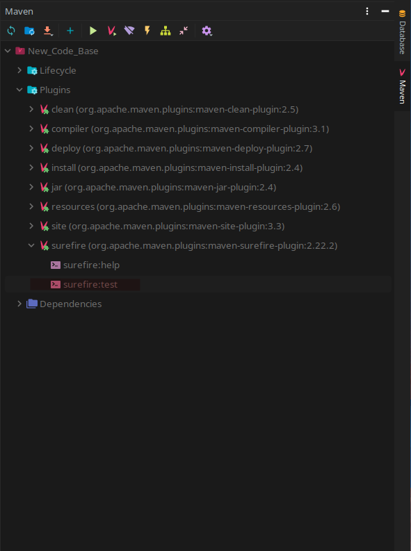

# Testing
The tests are written for the java framework Junit.  
Junit 5.8.1 is to be used for all unit testing.

## Instructions
Tests are created under the directory tests/.  
To run the tests use mavens surefire plugin or run the bundled configuration new_run_tests in intellij.

 

